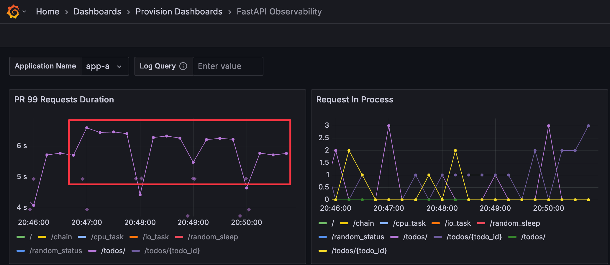
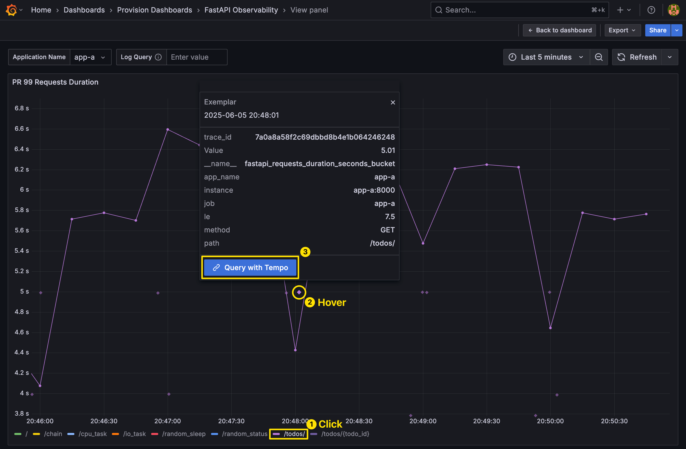
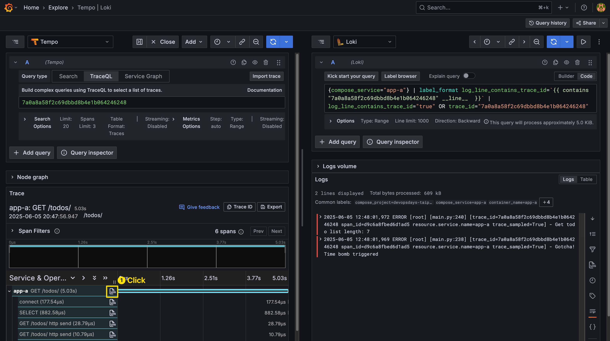

# Lab 01: Observability 平台

## Go Through

1. Observability Signals Data Flow 
   1. Metrics: Prometheus 設定、Prometheus Web UI http://localhost:9090
   2. Logs: Docker Compose Logging 設定
   3. Traces: OpenTelemetry 設定
      1. Basic Trace Demo
      2. App A Trace Demo
2. Grafana
   1. Datasource & Explore：Prometheus、Loki、Tempo
   2. Dashboard：cAdvisor exporter、FastAPI Observability、Spring Boot Observability
   3. 交互應用

## Tasks

### Task 1

1. 開啟 http://localhost:8000
2. 在 Explore 中查詢 App A 的 Log

<details>

<summary>Answer</summary>

Explore 查 Loki


</details>

### Task 2

1. 開啟 http://localhost:8000/chain
2. 在 Explore 中查詢 App A 該筆 Request 的 Trace

<details>

<summary>Answer</summary>

Explore 查 Tempo


</details>

### Task 3

1. 執行 `k6-script-todo.js`

    ```bash
    # k6 CLI
    k6 run --vus 3 --duration 300s k6-script-todo.js
    # k6 container
    docker compose -f docker-compose-k6.yaml up k6-todo
    ````

2. 檢視 FastAPI Observability Dashboard，排查 App A `todos/` 時間偏高的原因

<details>

<summary>Answer</summary>

1. Metrics 發現 `/todos/` 的時間偏高
   
2. View 放大 Panel，篩選出 `/todos/`，透過 Exemplar 連結至 Trace
   
   
3. 透過 Trace ID 檢視對應 Log，發現 Log 有 `Time bomb` 相關錯誤訊息
   

</details>
