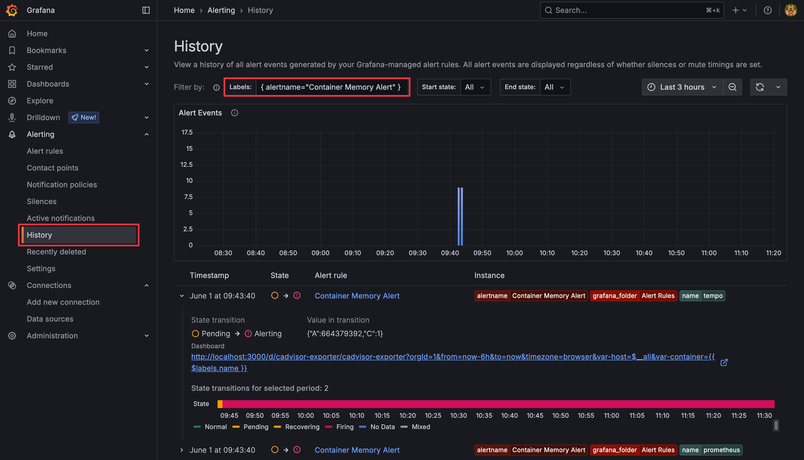

# Lab 02: Grafana Alerting

## Go Through

1. Provisioning Alerting:
   1. [Provision Alert - Request Rate](http://localhost:3000/alerting/grafana/demykhzytyh34c/view)
      1. Config with duplicate
      2. Alert View
   2. [History Page](http://localhost:3000/alerting/history?var-STATE_FILTER_FROM=all&var-STATE_FILTER_TO=all)
2. Provisioning Contact Points
   1. [webhook](http://localhost:3000/alerting/notifications/receivers/d2ViaG9vaw/edit)
      1. Config
      2. Test

## Tasks 

### Task 1

建立 Container Memory 使用量的 Alert，設定要求如下：

1. 使用 `sum(container_memory_usage_bytes{container_label_com_docker_compose_project="devopsdays-taipei-2025-observability-bootcamp"}) by (name)` 作為查詢條件
   1. `{container_label_com_docker_compose_project="devopsdays-taipei-2025-observability-bootcamp"}` 是 PromQL 篩選條件，只查詢 compose project 為 `devopsdays-taipei-2025-observability-bootcamp` 的 Container
   2. `sum(...) by (name)` 是 PromQL [聚合函數](https://prometheus.io/docs/prometheus/latest/querying/operators/#aggregation-operators)，將查詢結果依 Container 名稱加總，在這邊用於排除多餘的 Metric Label
2. 觸發條件：Memory 使用量超過 100 MB (100,000,000 bytes)
3. 查詢週期與狀態切換
   - 每 30 秒查詢一次
   - 連續 1 分鐘都高於觸發條件，進入 Alerting 狀態
   - 連續 3 分鐘都低於觸發條件，解除 Alerting 狀態
4. Contact Point：使用預先建立的 `webhook` Contact Point
5. (Bonus) Annotation：新增一組 key 為 `dashboard` 的欄位，值為 `http://localhost:3000/d/cadvisor-exporter/cadvisor-exporter` ，用於連結到 Cadvisor Exporter Dashboard，並將 Container 名稱帶入 Dashboard 的查詢參數

設定完成後確認 Alert 狀態、History Page、Webhook Log 等資訊。

Answer

1. 如下圖設定 Alert Rule，或者啟用 `etc/alerting/rules/alert-rule.yaml` 被註解掉的部分，然後重啟 Grafana Container `docker compose restart grafana`。
    
    
    
    Dashboard 連結使用 [Dashboard URL variables](https://grafana.com/docs/grafana/latest/dashboards/build-dashboards/create-dashboard-url-variables/) 以及 [label template](https://grafana.com/docs/grafana/latest/alerting/alerting-rules/templates/reference/#value) 達成。
2. 在 Alert Rules 頁面中選擇建立的 Alert Rule
    
   

3. 檢視 Alert Rule 的詳細資訊

    

4. 查看各 Instances 的狀態

    

5. 查看各 Instances 的 Alert History

    

6. 在 History 頁面中查看 Alert 的歷史紀錄

    

7. 查看 webhook container 的 Log，確認 Alert 發送成功

    

