# 從零到一：搭建你的第一個 Observability 平台

此 Project 為 DevOpsDays Taipei 2025 「[【Bootcamp】從零到一：搭建你的第一個 Observability 平台](https://devopsdays.tw/2025/workshop-page/3920)」 Workshop 所使用的範例程式碼。

Slide：從零到一：搭建你的第一個 Observability 平台

想了解更多可觀測性的內容，可以參考：

1. 可觀測性介紹書籍：[可觀測性入門指南：Logs、Metrics、Traces 三大實戰應用](https://www.tenlong.com.tw/products/9786263339538)
2. iThome 鐵人賽可觀測性系列文章：[時光之鏡：透視過去、現在與未來的 Observability](https://ithelp.ithome.com.tw/users/20162175/ironman/6445)
3. iThome 鐵人賽 Grafana 系列文章：[Grafana Zero to Hero](https://ithelp.ithome.com.tw/users/20162175/ironman/7185)
4. Observability 實作範例
   1. [FastAPI with Observability](https://github.com/blueswen/fastapi-observability)
   2. [Spring Boot with Observability](https://github.com/blueswen/spring-boot-observability)
   3. [OpenTelemetry Application Performance Management](https://github.com/blueswen/opentelemetry-apm)
5. PyCon TW 2024 [全方位強化 Python 服務可觀測性：以 FastAPI 和 Grafana Stack 為例](https://speakerdeck.com/blueswen/quan-fang-wei-qiang-hua-python-fu-wu-ke-guan-ce-xing-yi-fastapi-he-grafana-stack-wei-li)

## Architecture

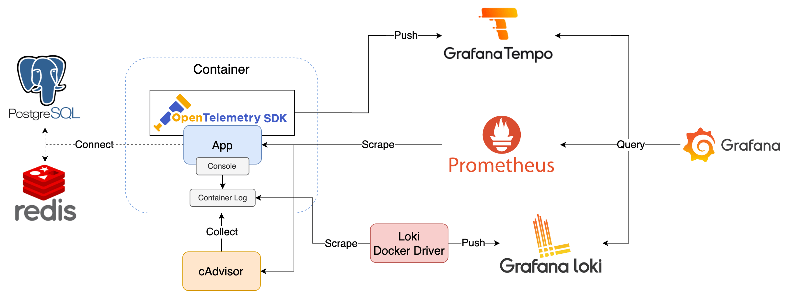

1. App：
   1. FastAPI Application
      1. basic.py：基本的 FastAPI Application，示範如何使用 [Prometheus Client Library](https://prometheus.github.io/client_python/) 以及 [Zero-code Instrumentation](https://opentelemetry.io/docs/zero-code/python/)
      2. main.py：進階的 FastAPI Application，示範如何使用 [Code-based Instrumentation](https://opentelemetry.io/docs/languages/python/instrumentation/)，並連接 PostgreSQL 和 redis
      3. webhook.py：接收 Alerting 發送的 Webhook
   2. Spring Boot Application
      1. 使用 [Micrometer](https://micrometer.io/) 生成 Metrics
      2. 使用 [OpenTelemetry Java Agent](https://opentelemetry.io/docs/languages/java/agent/) 達到 [Zero-code Instrumentation](https://opentelemetry.io/docs/concepts/instrumentation/zero-code/)
      3. 連接 PostgreSQL 和 redis
2. PostgreSQL：資料庫
3. redis：快取資料庫
4. cAdvisor Exporter：收集 Container 的 Metrics
5. Tempo：接收 OpenTelemetry SKD 發送的 Trace Data
6. Prometheus：爬取 Application、cAdvisor Exporter 的 Metrics
7. Loki Docker Driver：爬取 Container 的 Log 傳送至 Loki
8. Loki：接收 Loki Docker Driver 傳送的 Log
9. Grafana：查詢 Tempo、Prometheus、Loki 的資料

## Usage

1. Install Loki Docker Driver

   ```bash
   # For ARM64
   docker plugin install grafana/loki-docker-driver:3.3.2-arm64 --alias loki --grant-all-permissions
   # For AMD64
   docker plugin install grafana/loki-docker-driver:3.3.2-amd64 --alias loki --grant-all-permissions
   ```

2. Start all services

   ```bash
   docker compose up -d
   ```

3. Send Request to applications
   1. With Swagger UI
      1. basic: http://localhost:7779/docs
      2. app-a: http://localhost:8000/docs
      3. app-b: http://localhost:8001/docs
      4. app-c: http://localhost:8002/docs
      5. app-d: http://localhost:8003/swagger-ui/index.html
      6. webhook: http://localhost:8004/docs
   2. With [k6](https://k6.io/), [CLI installation guide](https://grafana.com/docs/k6/latest/set-up/install-k6/)

        ```bash
        # k6 CLI
        k6 run --vus 3 --duration 300s k6-script.js
        k6 run --vus 3 --duration 300s k6-script-todo.js
        # k6 container
        docker compose -f docker-compose-k6.yaml up k6
        docker compose -f docker-compose-k6.yaml up k6-todo
        ```

4. Open
   1. Prometheus: http://localhost:9090
   2. Grafana: http://localhost:3000 with `admin/admin`
      1. Visit provisioning dashboard
         1. [FastAPI Observability](http://localhost:3000/d/fastapi-observability/fastapi-observability)
         2. [Spring Boot Observability](http://localhost:3000/d/spring-boot-observability/spring-boot-observability)
         3. [Cadvisor exporter](http://localhost:3000/d/cadvisor-exporter/cadvisor-exporter)
      2. Explore Metrics, Logs, and Traces with [Grafana Explore](http://localhost:3000/explore)

5. Tear down all services

   ```bash
   docker compose down
   docker compose -f docker-compose-k6.yaml down
   ```

## 可觀測資訊連結方式

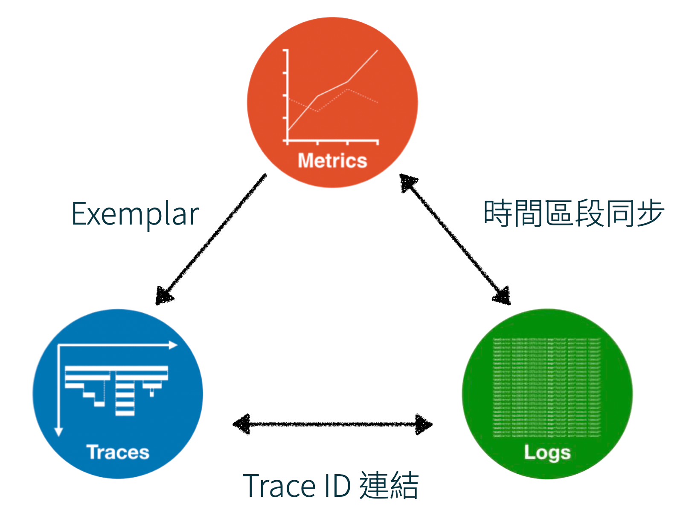

### Metrics vs Logs

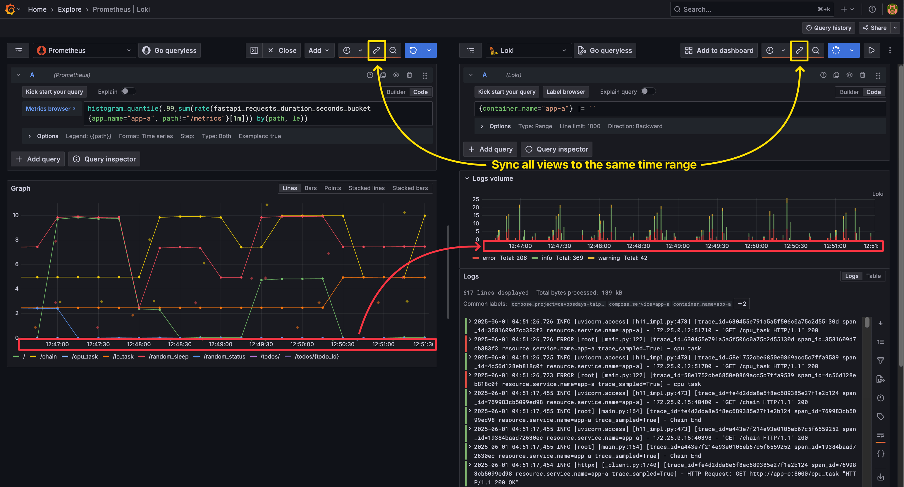

### Metrics to Traces

執行查詢 `histogram_quantile(.99,sum(rate(fastapi_requests_duration_seconds_bucket{app_name="app-a", path!="/metrics"}[1m])) by(path, le))` 並啟用 `Exemplar` 選項。

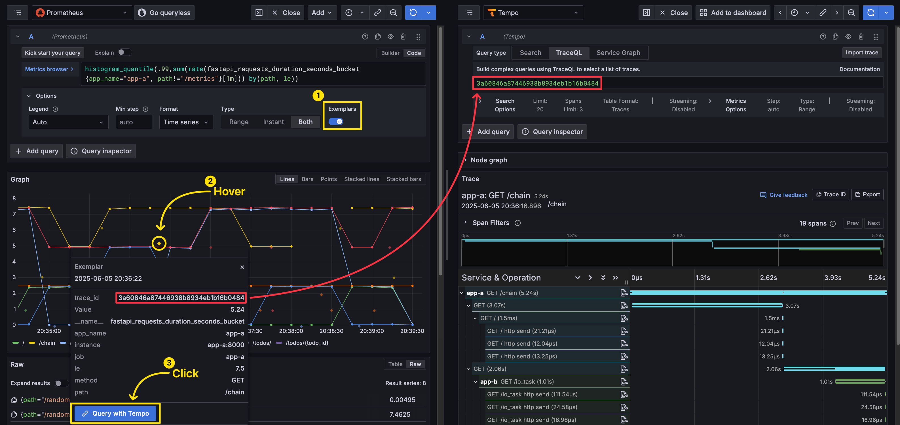

### Logs to Traces

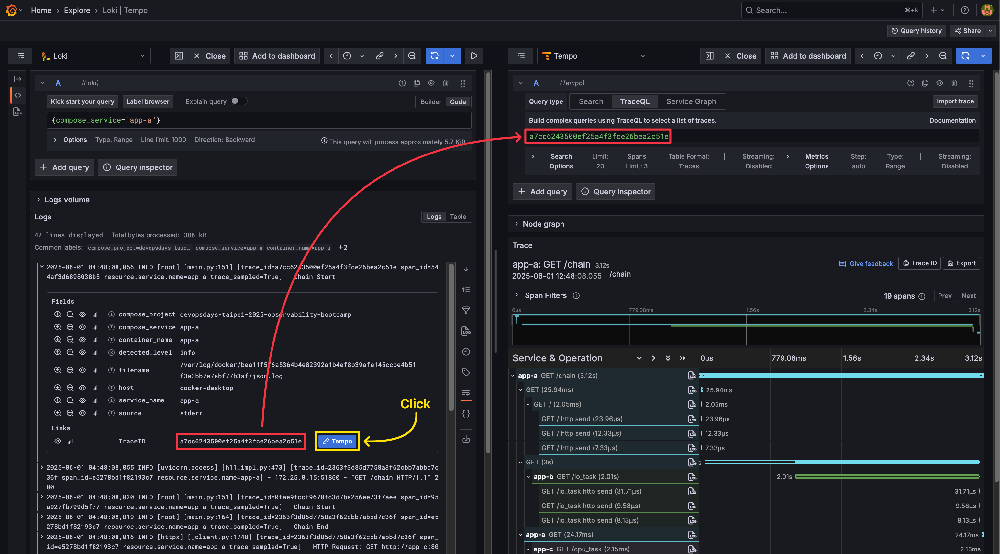

### Traces to Logs

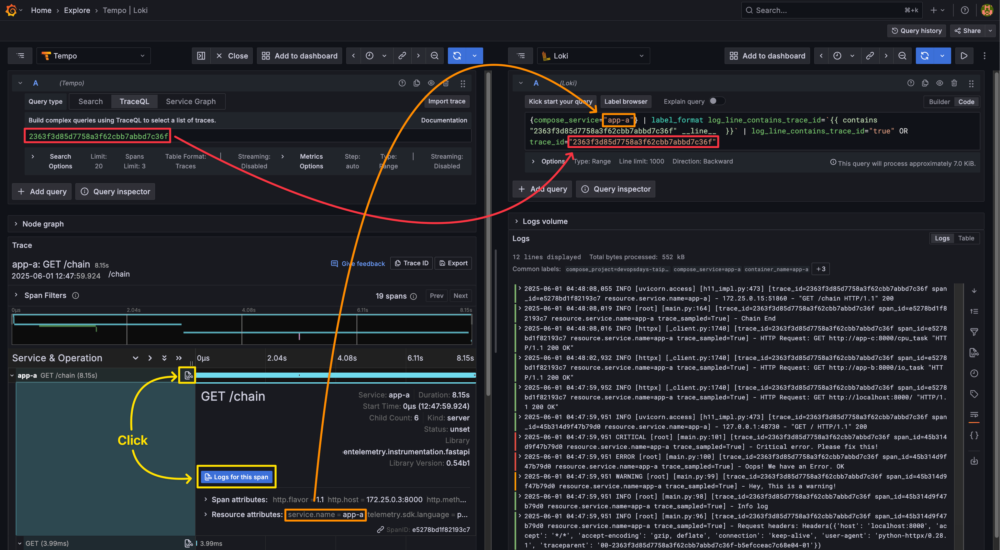

## Grafana Data Source 連結設定說明

本範例的 Data Source 設定皆透過 [Provisioning](https://grafana.com/docs/grafana/latest/administration/provisioning/) 的方式進行，以下僅用於說明各 Data Source 的設定內容，無需手動操作。

### Prometheus

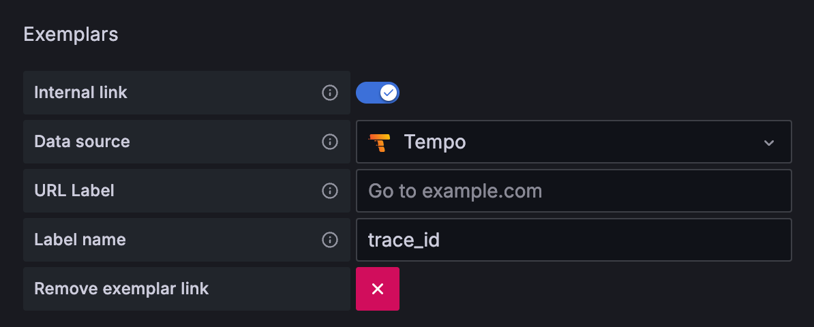

在 Prometheus Data Source 中設定 Exemplar 要連結的目標 Trace Data Source，以及 Trace ID 的 Label 名稱。

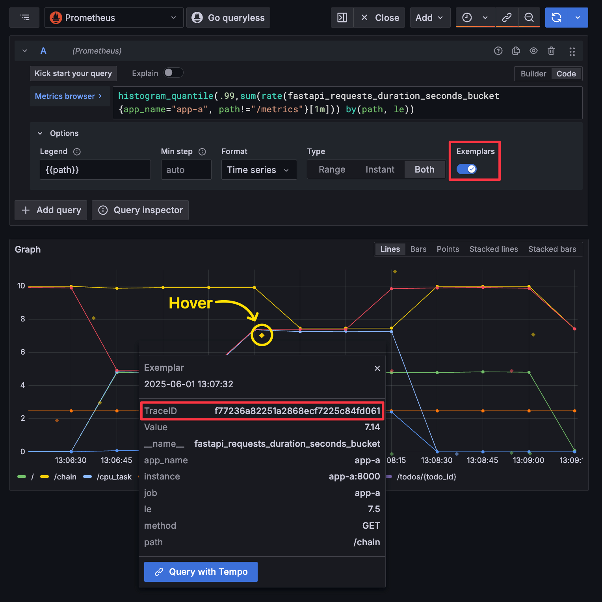

查詢 Metrics 時可以看到該 Exemplar 的詳細資訊，其中的 `TraceID` 就會作為 Trace Data Source 的 Trace ID 來查詢。

### Loki

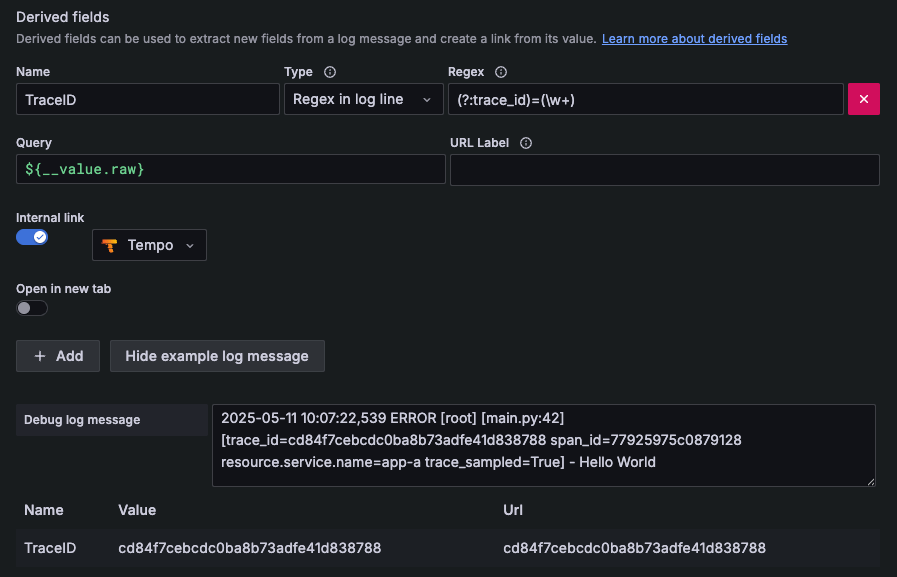

在 Loki Data Source 中設定如何解析出 Trace ID，這裡使用正則表達式 `(?:trace_id)=(\w+)` 取出 Log 中 `trace_id=` 後面的值，取得的值會作為 Tempo Data Source 的查詢參數，下方的 `Debug log message` 可以看到有成功取得 Trace ID。

### Tempo

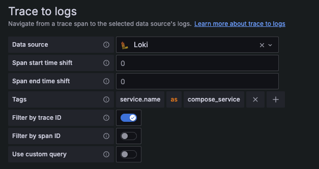

在 Tempo Data Source 中設定要連結的目標 Loki Data Source，因為 Loki 需要至少一個 `Label` 才能進行查詢，所以需要透過 Tags 指定 Trace 中的哪個資訊作為 Loki 的 Label，這裡使用 Trace 中的 `service.name` 作為 Loki 的 `compose_service` Label，並且同時用 Trace ID 作為文字篩選條件。

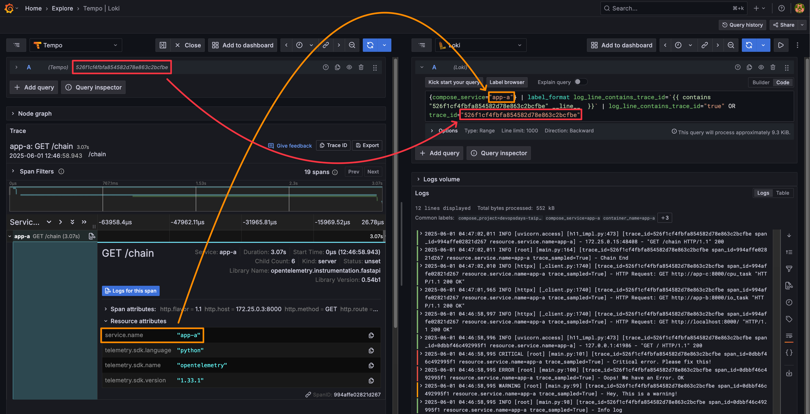

在這筆 Trace 的 Span 中，可以看到有 `service.name` 這個資訊，值為 `app-a`，點擊 `Logs for this span` 後右側展開的 Loki 查詢條件就會自動帶入 `compose_service="app-a"` 以及 Trace ID 篩選，這樣就可以查詢到該 Trace 在 `app-a` 的所有 Log 訊息。

## Alerting Monitoring

為了讓 Alerting 狀態可以更好被檢視，Grafana 能夠另外搭配 Loki 儲存 Alerting 相關 Log，達到以下功能：

1. [Alert State History](https://grafana.com/docs/grafana/latest/alerting/set-up/configure-alert-state-history/)：Grafana 10 新功能，啟用後搭配 Loki 能以視覺化的方式查看狀態變化
   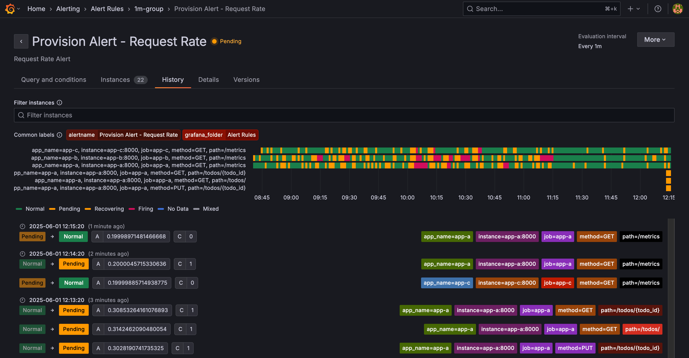
2. [Alerting History Page](https://grafana.com/docs/grafana/latest/alerting/monitor-status/view-alert-state-history/#view-from-the-history-page)：Grafana 11.2 新功能，啟用後可以查看所有 Alert 的 State 變化紀錄
   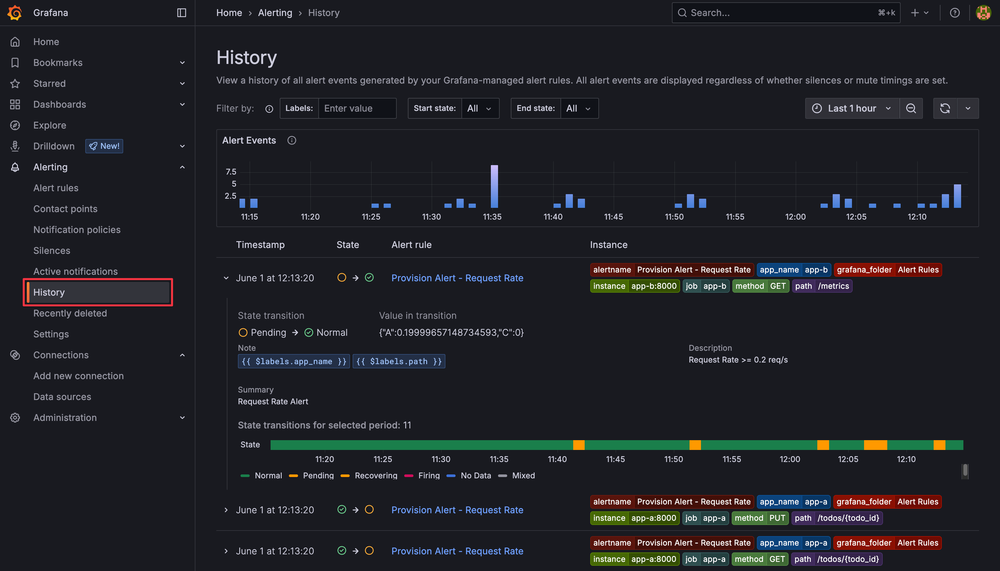

搭配 Loki 方式為設定 `grafana.ini` 設定檔：

```ini
# etc/grafana/grafana.ini
[unified_alerting.state_history]
enabled = true
backend = "loki"
loki_remote_url = "http://loki:3100"
```

Alerting History Page 需要另外啟用 Grafana feature `alertingCentralAlertHistory`，有兩種啟用方式：

- 在 `grafana.ini` 中設定 `feature_toggles`：

   ```ini
   [feature_toggles]
   alertingCentralAlertHistory = true
   ```

- 透過環境變數 `GF_FEATURE_TOGGLES_ENABLE` 設定：

   ```yaml
   grafana:
    image: grafana/grafana:12.0.1
    container_name: grafana
    environment:
      GF_FEATURE_TOGGLES_ENABLE: alertingCentralAlertHistory
   ```

Loki 可能會需要額外進行設定，官方另外也建議額外建立專用於 Alerting 的 Loki Instance，詳細說明可以參考 [Configure alert state history
 - Configuring](https://grafana.com/docs/grafana/latest/alerting/set-up/configure-alert-state-history/#configuring-loki)。

## References

1. [Cadvisor exporter Dashboard](https://grafana.com/grafana/dashboards/14282-cadvisor-exporter/)
